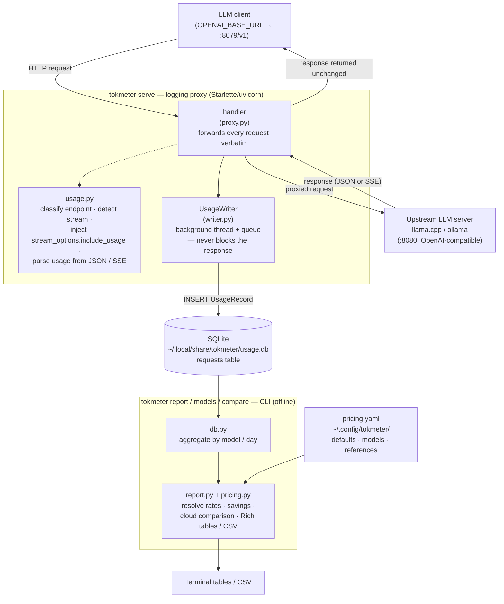

# tokmeter

**Ever had to justify to your partner why you spent four figures on GPUs?**
Here's your tool.

tokmeter is a transparent local proxy that logs LLM token usage per model to
SQLite and turns it into cost-savings reports. Point your clients at it, keep
running your local models as usual, and it quietly tallies every token you
*didn't* rent from the cloud — so the next time the hardware budget comes up at
dinner, you have receipts:

    .venv/bin/tokmeter compare
    # → Running locally has "saved" you $1,420 vs Claude Opus. You're welcome.

Sits in front of any OpenAI-compatible server (llama.cpp, ollama). Marital
outcomes not guaranteed.

## Architecture

tokmeter has two halves that meet at a shared SQLite database: a **live proxy**
that sits in your request path and records token usage, and an **offline CLI**
that reads that database to print reports.



**Live path (top):** a client points its `OPENAI_BASE_URL` at the proxy on
`:8079` instead of the backend on `:8080`. The proxy forwards every request and
returns every response unchanged, so it's transparent to the client. For tracked
endpoints (`chat/completions`, `completions`, `embeddings`) it parses the token
usage out of the response — injecting `stream_options.include_usage=true` on
streaming requests so the backend emits a final usage chunk — and hands a
`UsageRecord` to a background writer thread that persists it to SQLite. Capture is
best-effort: a parse error or a down database never breaks the proxied response.

**Reporting path (bottom):** the `report`, `models`, and `compare` commands read
the SQLite database directly (the proxy doesn't need to be running), aggregate
usage by model or day, apply rates from `pricing.yaml` to estimate
cloud-equivalent cost / savings, and render Rich tables (or CSV).

## Install

    python -m venv .venv
    .venv/bin/pip install -e .

## Run

    .venv/bin/tokmeter serve        # listens on 127.0.0.1:8079 -> 127.0.0.1:8080

Override with env vars: `TOKMETER_PORT`, `TOKMETER_UPSTREAM`, `TOKMETER_HOST`.

### Point your clients at the proxy

Change your client base URL from the backend port to the proxy:

    OPENAI_BASE_URL=http://127.0.0.1:8079/v1

Streaming note: tokmeter sets `stream_options.include_usage=true` on streaming
chat/completions requests so the backend reports token counts; clients receive the
standard final usage chunk.

## Run as a service (systemd --user)

    cp systemd/tokmeter.service ~/.config/systemd/user/
    systemctl --user daemon-reload
    systemctl --user enable --now tokmeter
    journalctl --user -u tokmeter -f

## Reports

    .venv/bin/tokmeter report                 # by model + totals
    .venv/bin/tokmeter report --by day
    .venv/bin/tokmeter report --since 2026-06-01 --until 2026-06-15
    .venv/bin/tokmeter report --by model --csv usage.csv
    .venv/bin/tokmeter models                 # models seen + pricing state

`default` in the report's Pricing column (and `[default]` in `models`) means the
model has no entry in `~/.config/tokmeter/pricing.yaml` and is priced at the global
default. Pricing keys are matched case-insensitively and ignore a trailing `.gguf`,
so `Qwen3.6-27B-UD-Q6_K_XL` matches the server-reported `Qwen3.6-27B-UD-Q6_K_XL.gguf`.

## Compare against cloud models

The main event. Estimate what your recorded local usage *would* have cost on cloud
models (i.e. your savings vs each) — the number you quote at dinner — using the
`references:` section of `pricing.yaml`:

    .venv/bin/tokmeter compare                      # totals: one row per reference
    .venv/bin/tokmeter compare --since 2026-06-01   # same filters as report
    .venv/bin/tokmeter compare --model Qwen3.6-27B-UD-Q6_K_XL.gguf
    .venv/bin/tokmeter compare --by-model           # matrix: local models x references

The shipped reference prices are **example placeholders** — edit
`~/.config/tokmeter/pricing.yaml` with current figures from
https://www.anthropic.com/pricing (and add other providers as needed).

A reference is only used if both `input_per_1m` and `output_per_1m` are present and
are numbers `>= 0`. An invalid or missing price does **not** silently become `$0.00`:
that reference is skipped and `compare` prints a warning naming it, so a typo can't
quietly understate your costs.

## Pricing

Copy the example and edit cloud-equivalent prices (USD per 1M tokens):

    mkdir -p ~/.config/tokmeter
    cp config/pricing.yaml ~/.config/tokmeter/pricing.yaml

## Electricity cost (net savings)

Add an optional `electricity:` block to `pricing.yaml` and reports subtract power
cost from the cloud-equivalent savings:

```yaml
electricity:
  price_per_kwh: 0.277   # your tariff (ElCom 2026 Swiss household average shown)
  currency: CHF
  usd_per_unit: 1.25     # FX for the net-savings line; omit to skip netting
  default_watts: 250

models:
  gemma-4-31b: { watts: 210 }   # per-model override: box draw for that model's GPU config
```

How it's estimated: requests are turned into time intervals (`ts` is the request end,
spanning `duration_ms` backwards), overlapping intervals of the same model are merged
(parallel slots aren't double-billed), and each model's active hours × watts gives kWh.
Different models add up — if two models run concurrently they're assumed to be on
different GPUs, both drawing power. Idle draw (model loaded, nothing generating) is not
counted, and `watts` values are your estimates — calibrate with a wall-plug meter for
precision. Reports re-price history retroactively whenever you edit the config.

## Development

    .venv/bin/pip install -e ".[dev]"
    .venv/bin/pytest

## License

[MIT](LICENSE) © Christopher Douillet
